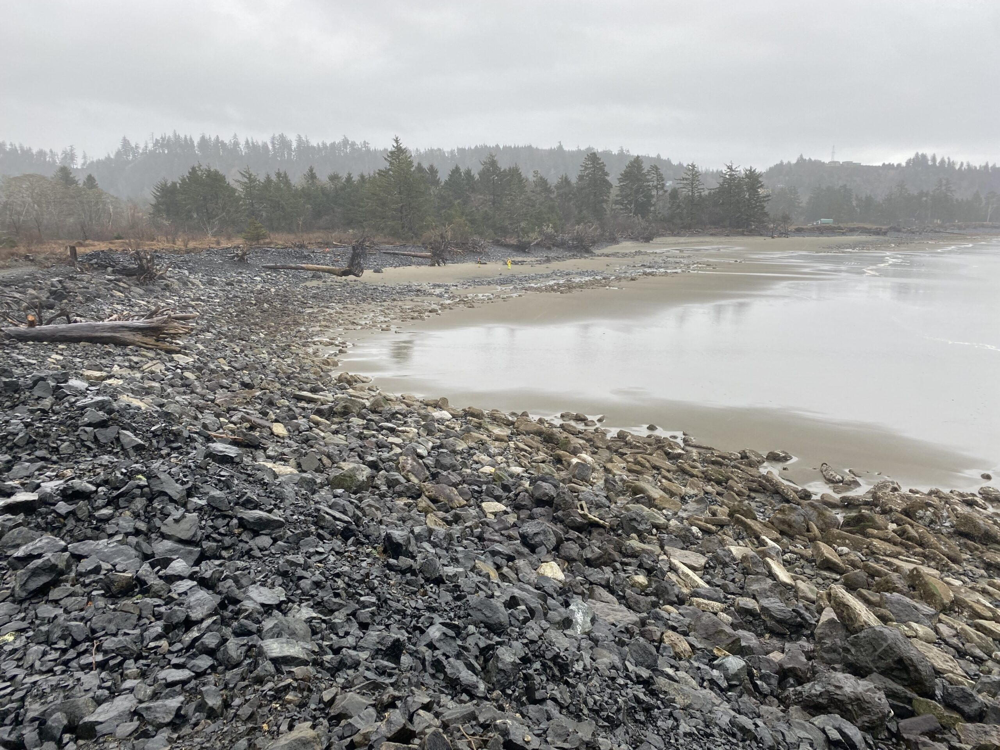
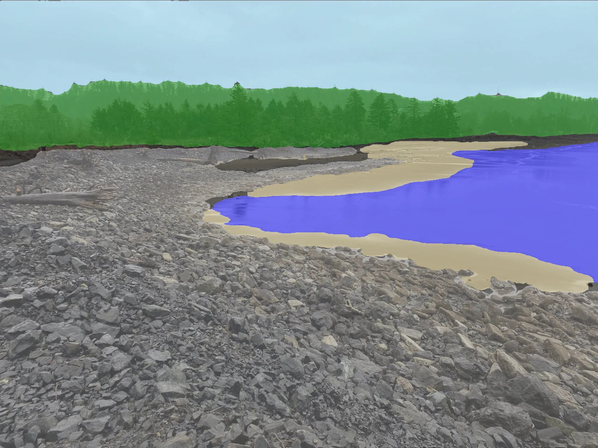

# CostalSeg: Image segmentation for costal erosion monitoring

## [Project Page](https://costalseg.github.io/) | [arXiv Paper]()

University of Washington ENGINE Capstone project: 

Machine Learning for Community-Driven Coastal Erosion Monitoring and Management

[Xinghao Chen](https://cxh42.github.io/) <sup>1,</sup><sup>2</sup>, [Zheheng Li](https://github.com/Martyr12333) <sup>1,</sup><sup>2</sup>, [Dylan Scott](https://github.com/dwilsons) <sup>1,</sup><sup>2</sup>, [] <sup>1,</sup><sup>2</sup>, [] <sup>1,</sup><sup>2</sup>, [] <sup>1,</sup><sup>2</sup>, [] <sup>1,</sup><sup>2</sup>, [] <sup>1,</sup><sup>2</sup>

<sup>1 </sup>University of Washington&emsp; <sup>2 </sup>University of Washington Applied Physics Laboratory &emsp;

<div style="display: flex; justify-content: center;">
    
    
</div>

Try image segmentation demo at  
https://huggingface.co/spaces/AveMujica/MetalMarcy  
https://huggingface.co/spaces/AveMujica/SilhouetteJaenette  

## News

## Environmental Setups
```bash
git clone https://github.com/cxh42/CostalSeg.git
cd CostalSeg
conda create -n CostalSeg python=3.12 
conda activate CostalSeg
pip install -r requirements.txt
```

## Data Preparation

**1. Training segmentation model from scratch:**

If you dont want to train model by yourself, just skip this step and turn to 2. Download our pretrained model. 

Download dataset for segmentation model training from [link](https://drive.google.com/file/d/184yJDCdGg8OZzl6mnEC8e8TvO_cK-qFU/view?usp=sharing), unzip the folder to project's root directory. 

Run `./SegmentModelTraining/MetalMarcy/train.py` and `./SegmentModelTraining/SilhouetteJaenette/train.py` to train model, then save your best trained .pth model to `./models`, rename them to `MM_best_model.pth` and `SJ_best_model.pth`

**2. Download our pretrained model:**

Download pretrained image segmentation model form [link](https://drive.google.com/file/d/1qGGWi3F_BLzHptIFHY33XDsABbfnalEB/view?usp=sharing), unzip the folder to project's root directory.

## Run
```bash
conda activate CostalSeg
python app.py
```
By running app.py, a graphical interactive interface will automatically open in the browser.

## Contributions

## Acknowledgement

## Citation
